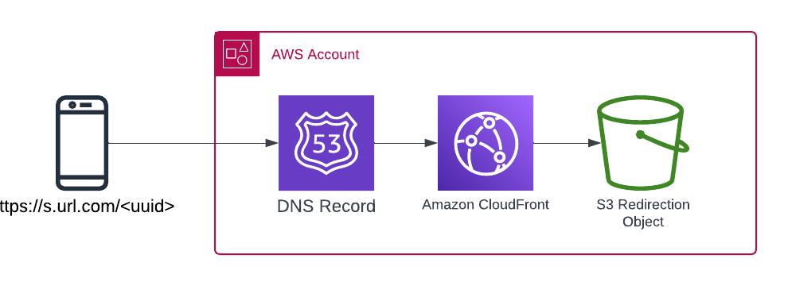

# Anatomy of a short URL and their uses

A short URL typically consists of a short domain name followed by a unique path that when accessed will take you to a 
longer URL.

## AWS Cloudfront Distribution + S3 website redirect

The most cost effective solution for AWS is to create a CloudFo




### Creating a shortURL via code

* CLI
* Go
* Javascript
* PHP

#### Creating a short URL via CLI

Creation of an object is as simple as putting an empty object into the S3 Bucket

    aws s3api put-object --website-redirect-location "https://xkcd.com/" --bucket s.ninjadeer.com --key kdDre3DS

    {
        "ETag": "\"d41d8cd98f00b204e9800998ecf8427e\"",
        "ServerSideEncryption": "AES256"
    }

We can check this is working with a look at the headers returned

    aws$ curl -I  https://s.ninjadeer.com/kdDre3DS

    HTTP/2 301
    content-length: 0
    location: https://xkcd.com/ <--------------------REDIRECT HEADER HERE
    date: Mon, 26 Feb 2024 08:56:33 GMT
    server: AmazonS3
    x-cache: Miss from cloudfront <------------------REDIRECT NOT CACHED
    via: 1.1 987140ac9e21c2b752b3eb80...
    x-amz-cf-pop: LHR50-P2
    x-amz-cf-id: rA79rcM0FH2MyEInplvN...

On subsequent runs we can see that the URL is cached and returned directly from our CDN

    ninjadeer@salamanca:~/GolandProjects/kiss-url-shortener/deployments/terragrunt/aws$ curl -I  https://s.ninjadeer.com/kdDre3DS
    HTTP/2 301
    location: https://xkcd.com/ <--------------------REDIRECT HEADER HERE
    x-cache: Hit from cloudfront <-------------------REDIRECT CACHED

#### GoLang

https://docs.aws.amazon.com/sdk-for-go/api/service/s3/#S3.PutObject

```golang
svc := s3.New(session.New())
input := &s3.PutObjectInput{

    Bucket:                  aws.String("s.ninjadeer.com"),
    Key:                     aws.String("kdDre3DS"),
    ServerSideEncryption:    aws.String("AES256"),
    WebsiteRedirectLocation: aws.String("https://xkcd.com/"),
}

result, err := svc.PutObject(input)
if err != nil {
    if aerr, ok := err.(awserr.Error); ok {
        switch aerr.Code() {
        default:
            fmt.Println(aerr.Error())
        }
    } else {
        // Print the error, cast err to awserr.Error to get the Code and
        // Message from an error.
        fmt.Println(err.Error())
    }
    return
}

fmt.Println(result)
```

#### Node JS

``` javascript
 var params = {
  Bucket: "s.ninjadeer.com", 
  Key: "kdDre3DS", 
  ServerSideEncryption: "AES256", 
  WebsiteRedirectLocation: "https://xkcd.com/"
 };

 s3.putObject(params, function(err, data) {
   if (err) console.log(err, err.stack); // an error occurred
   else     console.log(data);           // successful response
 });
```

#### PHP

https://docs.aws.amazon.com/aws-sdk-php/v3/api/api-s3-2006-03-01.html#putobject

``` php
<?php
$result = $client->putObject([
    'Bucket' => 's.ninjadeer.com', // REQUIRED
    'Key' => 'kdDre3DS', // REQUIRED
    'ServerSideEncryption' => 'AES256',
    'WebsiteRedirectLocation' => '<string>',
]);
```