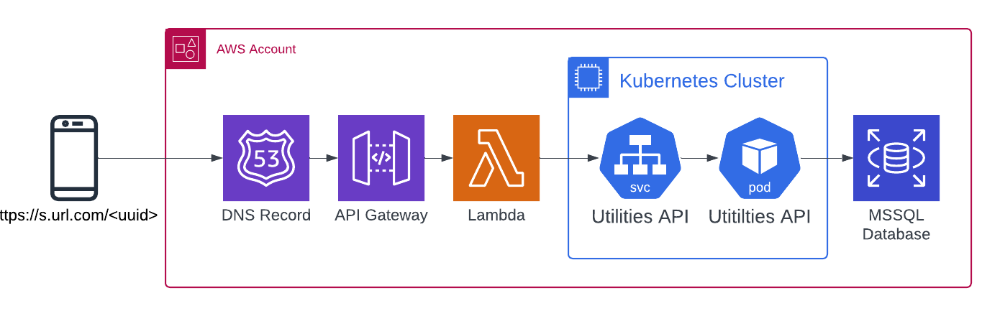
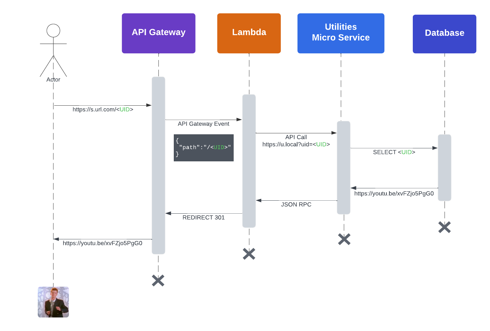
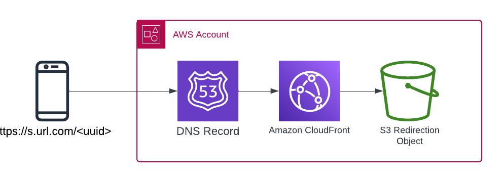

# Case study

### Costings

To calculate the cost of the shortening service we need to consider the following

* Lambda execute time and memory usage, additionally ECR Image storage and transfer costs
* API Gateway invocation fees and data charges.
* Kubernetes cpu and memory usages as a fraction of the cost of the nodes
* MSSQL storage space EBS, compute and memory usage as a fraction of the cluster cost

### Execution duration

If we look at the following diagram we can see that the Lambda duration will be influenced by the following factors

* Duration of HTTP API request for accessing the Utils service, this may increase as our service receives more traffic
* Duration of the SELECT query to th Database

We can assume that as the solution received more traffic on services directly related to the shortner or other business
activities on either the Database or Utilities service the Duration will of the Lambda start will increase as

## Comparison with a CDN and S3 Architecture

### Costings

In this solution we need to consider the costings of the following

* Cloud Distribution Network traffic
* S3 Storage of the short links

